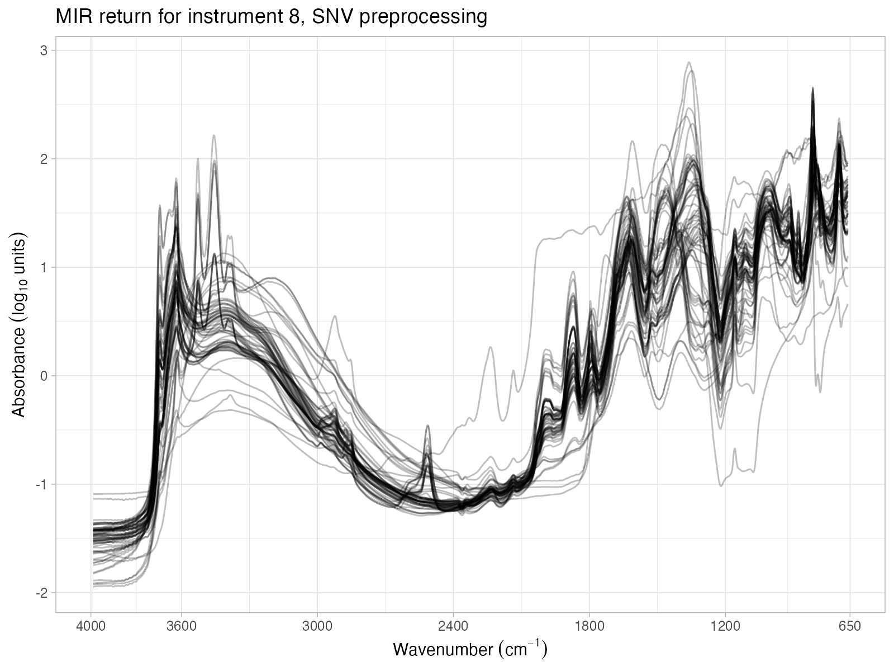
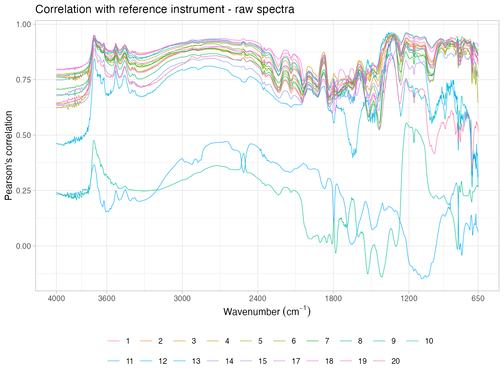

Soil spectroscopy ring trial
================

- <a href="#overview" id="toc-overview">Overview</a>
- <a href="#spectral-visualization"
  id="toc-spectral-visualization">Spectral visualization</a>
- <a href="#instances-check" id="toc-instances-check">Instances check</a>
- <a href="#principal-component-analysis"
  id="toc-principal-component-analysis">Principal component analysis</a>
- <a href="#correlation-spectra" id="toc-correlation-spectra">Correlation
  spectra</a>
- <a href="#correlation-matrix" id="toc-correlation-matrix">Correlation
  matrix</a>
- <a href="#dissimilarity-analysis"
  id="toc-dissimilarity-analysis">Dissimilarity analysis</a>

## Overview

Inter-laboratory comparison of soil spectral measurements as part of the
SoilSpec4GG project.

This repository is used for exploring the instruments variability with
visual inspection, PCA projection, correlation spectra, correlation
matrices, and dissimilarity analysis.

The datasets were prepared to a target format in
[soilspectroscopy/ringtrial-prep](https://github.com/soilspectroscopy/ringtrial-prep).

The workspace development is defined by:

- GitHub repository:
  [soilspectroscopy/ringtrial-eda](https://github.com/soilspectroscopy/ringtrial-eda).
- Google Cloud storage for efficient file storage and access:
  [whrc.org/soilcarbon-soilspec/storage/sc-ringtrial](https://console.cloud.google.com/storage/browser/sc-ringtrial).

## Spectral visualization

All instruments were plotted and are available at
`outputs/check_spectra/plot_mir_instrument<number>_<preprocessing>.png`.
A grid with all spectral variations is displayed below for instrument 8
(Woodwell Climate vertex) as an illustration example.

<!--    -->
<!--    -->
<!--    -->
<!--    -->
<!--    -->
<!--    -->

## Instances check

All separate plots are available at
`outputs/instance_spectra/plot_instance_comparison_<preprocessing>_<type>.png`
with type being either for all instruments or 3 selected organizations.
A grid with all plot variations is displayed below including a dedicated
plot for evaluating the SST alignment.

<!--    -->
<!--    -->
<!--    -->
<!--    -->
<!--    -->
<!--    -->

## Principal component analysis

All separate plots are available at
`outputs/pca_projection/plot_pca_scores_projection_<preprocessing>_all.png`.
A grid with all plot variations is displayed below including a dedicated
plot for evaluating the SST alignment.

<!--    -->
<!--    -->
<!--    -->
<!--    -->
<!--    -->
<!--    -->

## Correlation spectra

All separate plots are available at
`outputs/correlation_spectra/plot_correlation_spectra_<preprocessing>_all.png`.
A grid with all plot variations is displayed below including a dedicated
plot for evaluating the SST alignment.

<!--    -->
<!--    -->
<!--    -->
<!--    -->
<!--    -->
<!--    -->

## Correlation matrix

All separate plots are available at
`outputs/correlation_matrix/plot_correlation_matrix_<preprocessing>_all.png`.
A grid with all plot variations is displayed below including a dedicated
plot for evaluating the SST alignment.

<!--    -->
<!--    -->
<!--    -->
<!--    -->
<!--    -->
<!--    -->

## Dissimilarity analysis

All separate plots are available at
`outputs/similarity/plot_dissimilarity_<preprocessing>.png`. A grid with
all plot variations is displayed below including a dedicated plot for
evaluating the SST alignment.

<!--    -->
<!--    -->
<!--    -->
<!--    -->
<!--    -->
<!--    -->
