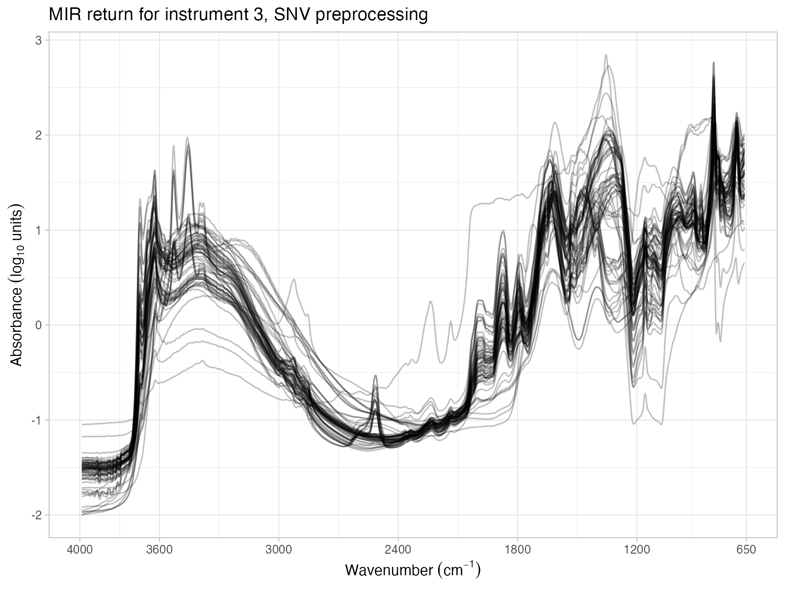
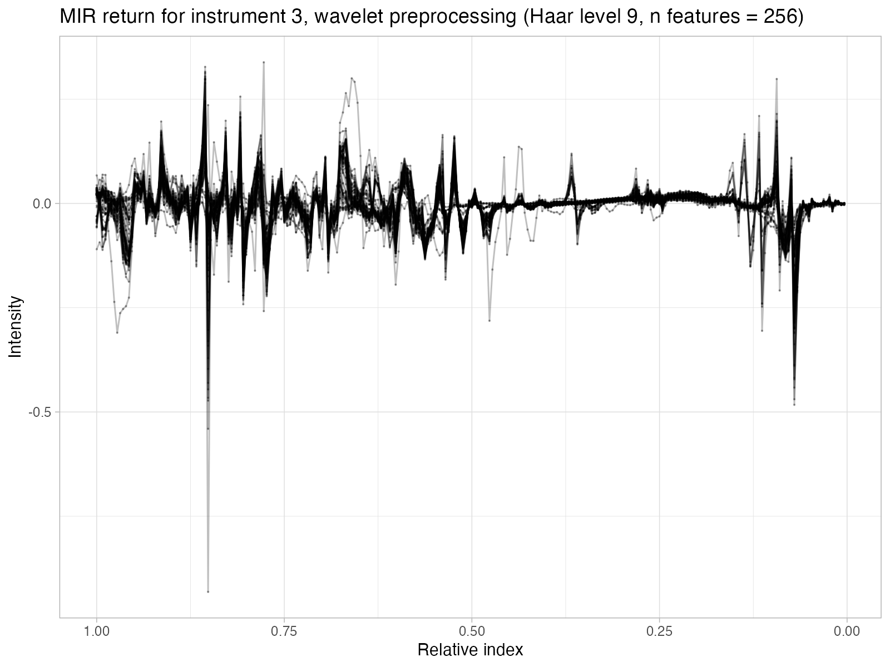

Soil spectroscopy ring trial
================

-   <a href="#overview" id="toc-overview">Overview</a>
-   <a href="#spectral-visualization"
    id="toc-spectral-visualization">Spectral visualization</a>
-   <a href="#principal-component-analysis"
    id="toc-principal-component-analysis">Principal component analysis</a>
-   <a href="#correlation-spectra" id="toc-correlation-spectra">Correlation
    spectra</a>
-   <a href="#correlation-matrix" id="toc-correlation-matrix">Correlation
    matrix</a>
-   <a href="#dissimilarity-analysis"
    id="toc-dissimilarity-analysis">Dissimilarity analysis</a>

## Overview

Inter-laboratory comparison of soil spectral measurements as part of the
SoilSpec4GG project.

This repository is used for exploring the instruments variability with
visual inspection, PCA projection, correlation spectra, correlation
matrices, and dissimilarity analysis.

The datasets were prepared to a target format in
[soilspectroscopy/ringtrial-prep](https://github.com/soilspectroscopy/ringtrial-prep).

The workspace development is defined by:

-   GitHub repository:
    [soilspectroscopy/ringtrial-eda](https://github.com/soilspectroscopy/ringtrial-eda).
-   Google Cloud storage for efficient file storage and access:
    [whrc.org/soilcarbon-soilspec/storage/sc-ringtrial](https://console.cloud.google.com/storage/browser/sc-ringtrial).

## Spectral visualization

Instrument 3 is `Woodwell vertex`.

<!--    -->
<!--    -->
<!--    -->
<!--    -->
<!--    -->
<!--    -->

## Principal component analysis

## Correlation spectra

## Correlation matrix

## Dissimilarity analysis
